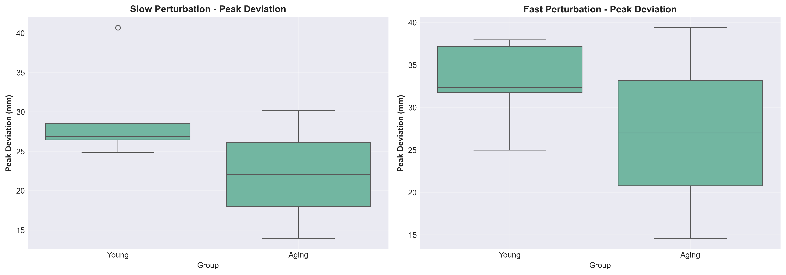

```{css, echo=FALSE}
/* ================== SIDEBAR TOC - FIXED ================== */
#TOC {
    position: fixed !important;
    left: 0;
    top: 0;
    width: 280px;
    height: 100vh;
    overflow-y: auto;
    background: linear-gradient(180deg, #f8f9fa 0%, #e9ecef 100%);
    padding: 30px 20px;
    border-right: 3px solid #667eea;
    box-shadow: 2px 0 10px rgba(0,0,0,0.1);
    z-index: 1000;
}

#TOC ul {
    list-style: none;
    padding-left: 0;
}

#TOC li {
    margin-bottom: 12px;
}

#TOC a {
    color: #2c3e50;
    text-decoration: none;
    font-weight: 500;
    transition: all 0.3s;
    display: block;
    padding: 8px 12px;
    border-radius: 5px;
    font-size: 0.95em;
}

#TOC a:hover {
    background-color: #667eea;
    color: white;
    transform: translateX(5px);
}

#TOC .active {
    background-color: #764ba2;
    color: white;
    font-weight: 700;
}

/* Main content - offset for sidebar */
.main-container {
    margin-left: 300px !important;
    max-width: 1000px !important;
    width: calc(100% - 320px) !important;
    padding: 40px !important;
}

/* ================== BANNER ================== */
.banner {
    background: linear-gradient(135deg, #667eea 0%, #764ba2 100%);
    color: white;
    padding: 60px 40px;
    border-radius: 15px;
    text-align: center;
    margin-bottom: 40px;
    box-shadow: 0 10px 30px rgba(0,0,0,0.2);
}

.banner h1.title {
    font-size: 2.5em;
    margin-bottom: 20px;
    font-weight: 700;
    color: white;
}

.banner .subtitle {
    font-size: 1.3em;
    margin-bottom: 15px;
    font-weight: 300;
    color: white;
}

.banner .author {
    font-size: 1.1em;
    margin-top: 20px;
    font-weight: 400;
}

.banner .date {
    font-size: 1em;
    margin-top: 10px;
    font-style: italic;
}

/* ================== CONTENT STYLING ================== */
body {
    font-family: 'Segoe UI', Tahoma, Geneva, Verdana, sans-serif;
    line-height: 1.7;
    color: #2c3e50;
    background-color: #f5f7fa;
}

h1, h2, h3, h4 {
    color: #667eea;
    font-weight: 600;
    margin-top: 30px;
}

h1 {
    border-bottom: 3px solid #667eea;
    padding-bottom: 10px;
}

h2 {
    border-bottom: 2px solid #e9ecef;
    padding-bottom: 8px;
}

/* ================== HIGHLIGHT BOXES ================== */
.highlight {
    background: linear-gradient(135deg, #e8f0fe 0%, #f0f4ff 100%);
    border-left: 5px solid #667eea;
    padding: 20px;
    margin: 25px 0;
    border-radius: 8px;
    box-shadow: 0 3px 10px rgba(0,0,0,0.08);
}

.key-result {
    background: linear-gradient(135deg, #fff3e0 0%, #ffe8cc 100%);
    border-left: 5px solid #ff9800;
    padding: 20px;
    margin: 25px 0;
    border-radius: 8px;
    box-shadow: 0 3px 10px rgba(0,0,0,0.08);
}

.warning {
    background: linear-gradient(135deg, #ffebee 0%, #ffcdd2 100%);
    border-left: 5px solid #f44336;
    padding: 20px;
    margin: 25px 0;
    border-radius: 8px;
    box-shadow: 0 3px 10px rgba(0,0,0,0.08);
}

/* ================== TABLES ================== */
table {
    border-collapse: collapse;
    width: 100%;
    margin: 25px 0;
    background-color: white;
    box-shadow: 0 2px 8px rgba(0,0,0,0.1);
    border-radius: 8px;
    overflow: hidden;
}

th {
    background: linear-gradient(135deg, #667eea 0%, #764ba2 100%);
    color: white;
    padding: 15px;
    text-align: left;
    font-weight: 600;
}

td {
    padding: 12px 15px;
    border-bottom: 1px solid #e9ecef;
}

tr:hover {
    background-color: #f8f9fa;
}

/* ================== FIGURES ================== */
img {
    max-width: 100%;
    height: auto;
    border-radius: 8px;
    box-shadow: 0 4px 15px rgba(0,0,0,0.15);
    margin: 20px 0;
}

.figure {
    text-align: center;
    margin: 30px 0;
}

p.caption {
    font-style: italic;
    color: #546e7a;
    margin-top: 10px;
    font-size: 0.95em;
}

/* ================== CODE BLOCKS ================== */
pre {
    background-color: #263238;
    border-radius: 8px;
    padding: 20px;
    overflow-x: auto;
    box-shadow: 0 3px 10px rgba(0,0,0,0.2);
}

code {
    font-family: 'Courier New', monospace;
    font-size: 0.9em;
}

/* ================== FOOTER ================== */
.footer {
    margin-top: 60px;
    padding: 30px;
    background: linear-gradient(135deg, #2c3e50 0%, #34495e 100%);
    color: white;
    text-align: center;
    border-radius: 10px;
    box-shadow: 0 5px 20px rgba(0,0,0,0.2);
}

.footer p {
    margin: 8px 0;
}

.footer a {
    color: #667eea;
    text-decoration: none;
    font-weight: 600;
    transition: color 0.3s;
}

.footer a:hover {
    color: #764ba2;
}

/* ================== RESPONSIVE ================== */
@media (max-width: 768px) {
    #TOC {
        position: relative !important;
        width: 100%;
        height: auto;
    }
    
    .main-container {
        margin-left: 0 !important;
        width: 100% !important;
    }
}
```

```{r setup, include=FALSE}
knitr::opts_chunk$set(
  echo = FALSE,
  message = FALSE,
  warning = FALSE,
  fig.align = 'center',
  fig.width = 10,
  fig.height = 6
)

# Load required libraries
library(knitr)
library(kableExtra)
```

```{=html}
<div class="banner">
  <h1 class="title">Postural Resilience Analysis Using Time-Delay Embedding</h1>
  <p class="subtitle">Master IEAP Project Report: TDE Pipeline Development & Validation</p>
  <p class="author"><strong>Victor SALVAT</strong></p>
  <p class="date">April 2026</p>
  <p style="margin-top: 20px; font-size: 0.95em;">
    Master Ingénierie et Ergonomie de l'Activité Physique (IEAP)<br>
    EuroMov Digital Health in Motion Laboratory | BeatHealth Project<br>
    University of Montpellier
  </p>
</div>
```

```{=html}
<div style="background-color: white; padding: 30px; border-radius: 10px; margin-bottom: 40px; box-shadow: 0 2px 8px rgba(0,0,0,0.1);">
  <table style="width: 100%; border: none; box-shadow: none;">
    <tr style="border: none;">
      <td style="border: none; padding: 8px 0;"><strong>Étudiant :</strong></td>
      <td style="border: none; padding: 8px 0;">Victor SALVAT</td>
    </tr>
    <tr style="border: none;">
      <td style="border: none; padding: 8px 0;"><strong>Formation :</strong></td>
      <td style="border: none; padding: 8px 0;">Master Ingénierie et Ergonomie de l'Activité Physique (IEAP)</td>
    </tr>
    <tr style="border: none;">
      <td style="border: none; padding: 8px 0;"><strong>Année universitaire :</strong></td>
      <td style="border: none; padding: 8px 0;">2025-2026</td>
    </tr>
    <tr style="border: none;">
      <td style="border: none; padding: 8px 0;"><strong>Encadrant :</strong></td>
      <td style="border: none; padding: 8px 0;">Antoine DUFOURNEAU</td>
    </tr>
    <tr style="border: none;">
      <td style="border: none; padding: 8px 0;"><strong>Tuteur stage :</strong></td>
      <td style="border: none; padding: 8px 0;">Loïc DAMM</td>
    </tr>
    <tr style="border: none;">
      <td style="border: none; padding: 8px 0;"><strong>Cours :</strong></td>
      <td style="border: none; padding: 8px 0;">Python-R-Git Project</td>
    </tr>
    <tr style="border: none;">
      <td style="border: none; padding: 8px 0;"><strong>Dépôt GitHub :</strong></td>
      <td style="border: none; padding: 8px 0;"><a href="https://github.com/VictorSal0student/resilience-postural-salvat-victor" target="_blank" style="color: #667eea; font-weight: 600;">https://github.com/VictorSal0student/resilience-postural-salvat-victor</a></td>
    </tr>
  </table>
</div>
```

---

# Introduction

**Falls** represent a major **public health concern** affecting approximately **one-third of adults aged 65+ years** annually, with consequences ranging from physical injuries to loss of autonomy. Among physiological factors contributing to fall risk, **postural control deterioration** plays a central role. Traditional balance assessment methods such as clinical scales and static posturography provide valuable but limited insights, often failing to capture **dynamic complexity of real-world perturbations**.

**Postural resilience**, defined as the ability to recover stability following unexpected perturbations, has emerged as a **critical marker of functional balance capacity** in aging populations. **Time-Delay Embedding (TDE)** offers a mathematical framework derived from dynamical systems theory that reconstructs the underlying **attractor governing postural control** from univariate time series measurements. The TDE approach, formalized by **Takens' embedding theorem**, enables **state-space reconstruction** from a single measured variable by creating delayed copies of the signal, revealing geometric structure of system dynamics.

Two critical parameters govern reconstruction quality: **time delay (τ)** determining temporal spacing between embedded dimensions, and **embedding dimension (dim)** specifying reconstructed space dimensionality. Optimal parameter selection ensures **accurate representation** while avoiding spurious correlations or insufficient dimensional representation.

This project was conducted during a **Master's internship** at the **EuroMov Digital Health in Motion Laboratory** as part of the **BeatHealth research initiative**. The primary objective was to develop, validate, and deploy an **automated Time-Delay Embedding analysis pipeline** for processing motion capture data from perturbation experiments and extracting **quantitative resilience metrics**. A secondary objective involved validating a **synchronization framework** for integrating CODAMOTION optical motion capture with BeatMove inertial measurement recordings.

The present report documents pipeline development, validation on **seven participants (five young adults, two aging adults)**, and synchronization testing on two technical validation sessions. Results demonstrate successful **automated parameter optimization**, robust **perturbation detection**, and significant **recovery time differences between age groups** consistent with established literature.

---

# Methods

## Participants and Experimental Protocol

The study cohort comprised **seven healthy adults** divided into two groups: **five young adults** (mean age **24.2 ± 2.1 years**, range 22-27 years, identifiers 004, 005, 008, 009, 017) and **two aging adults** (mean age **71.5 ± 3.5 years**, range 69-74 years, identifiers 006, 010). All participants provided **written informed consent** and reported no history of neurological disorders, vestibular dysfunction, or musculoskeletal injuries affecting balance performance. The aging group participants were **community-dwelling individuals** with independent living status and no assistive device requirements for daily ambulation.

## Experimental Protocol

The experimental protocol employed auditory perturbations designed to elicit postural recovery responses. Participants stood on a motorized treadmill maintaining comfortable upright stance while the treadmill belt advanced at constant velocity (0.3 m/s). Two types of unexpected auditory perturbations were delivered at randomized intervals: **slow perturbations** consisting of low-frequency beeps (gradual tempo decrease), and **fast perturbations** involving high-frequency beeps (abrupt tempo increase). Each participant completed a single recording session comprising approximately 8-10 perturbations of each type distributed across a 6-minute acquisition period.

Participants were instructed to maintain natural upright stance, avoid anticipatory adjustments, and respond naturally to auditory cues without stepping off the treadmill. Visual feedback was minimized by having participants focus on a wall-mounted target positioned at eye level 2 meters anterior. No practice trials were provided to preserve perturbation unexpectedness.

## Data Acquisition Systems

Two distinct acquisition protocols were employed: TDE analysis on N=7 participants using CODAMOTION alone, and synchronization validation on two technical sessions using CODAMOTION plus BeatMove.

### CODAMOTION Optical Motion Capture (N=7 TDE Protocol)

Three-dimensional kinematic data were recorded using a **CODAMOTION active marker system** (Charnwood Dynamics Ltd, UK) comprising four CX1 scanner units positioned at corners of a 4-meter capture volume. The system tracked infrared LED markers with **submillimeter spatial precision** at **400 Hz native sampling frequency**. A single marker positioned at the **sacrum approximating body center of mass** was utilized as the primary measurement variable. Raw marker trajectories were exported as **C3D binary files** containing timestamped three-dimensional position vectors in the laboratory reference frame (X: anterior-posterior, Y: medio-lateral, Z: vertical).

### BeatMove Inertial Measurement (Synchronization Validation Only)

For synchronization validation sessions (participants **016 and 017**), complementary inertial data were acquired using the **BeatMove smartphone application** recording triaxial accelerometer signals at **100 Hz** from a device secured to the participant's lower back. BeatMove provided **real-time step detection** and exported data as CSV files with timestamped acceleration vectors. This **dual-sensor setup** validated the synchronization framework required for future studies incorporating **adaptive auditory feedback**, but was not used during the N=7 TDE analysis.

## Time-Delay Embedding Pipeline

```{=html}
<div class="pipeline-flowchart">
  <div class="pipeline-step">
    <div class="step-box">Raw Data<br><small>CODAMOTION 400 Hz</small></div>
    <div class="arrow">→</div>
  </div>
  <div class="pipeline-step">
    <div class="step-box">EMD<br><small>Decomposition IMFs</small></div>
    <div class="arrow">→</div>
  </div>
  <div class="pipeline-step">
    <div class="step-box">Filtering<br><small>Butterworth 5 Hz</small></div>
    <div class="arrow">→</div>
  </div>
  <div class="pipeline-step">
    <div class="step-box">Downsampling<br><small>400 → 100 Hz</small></div>
    <div class="arrow">→</div>
  </div>
  <div class="pipeline-step">
    <div class="step-box">TDE<br><small>AMI, FNN</small></div>
    <div class="arrow">→</div>
  </div>
  <div class="pipeline-step">
    <div class="step-box">State-Space<br><small>4D Reconstruction</small></div>
    <div class="arrow">→</div>
  </div>
  <div class="pipeline-step">
    <div class="step-box">Metrics<br><small>Recovery, Peak</small></div>
  </div>
</div>

<style>
.pipeline-flowchart {
  display: flex;
  justify-content: center;
  align-items: center;
  margin: 30px 0;
  flex-wrap: wrap;
}
.pipeline-step {
  display: flex;
  align-items: center;
}
.step-box {
  background: linear-gradient(135deg, #667eea 0%, #764ba2 100%);
  color: white;
  padding: 15px 20px;
  border-radius: 8px;
  text-align: center;
  font-weight: bold;
  min-width: 120px;
  box-shadow: 0 4px 6px rgba(0,0,0,0.1);
}
.step-box small {
  display: block;
  font-size: 11px;
  font-weight: normal;
  margin-top: 5px;
  opacity: 0.9;
}
.arrow {
  font-size: 24px;
  margin: 0 10px;
  color: #667eea;
  font-weight: bold;
}
</style>
```

### Signal Preprocessing

The preprocessing pipeline began with sacrum marker anterior-posterior displacement extracted from C3D files (400 Hz native frequency). Three sequential stages isolated postural control dynamics from measurement artifacts:

**Stage 1 - Empirical Mode Decomposition (EMD):** The raw 400 Hz signal was decomposed into **intrinsic mode functions (IMFs)** representing oscillatory components at different temporal scales. EMD **adaptively separates signals** based on local extrema without predetermined basis functions. The **two highest-frequency IMFs** (measurement noise, physiological tremor) were discarded; remaining IMFs were summed to reconstruct a **denoised signal**.

**Stage 2 - Butterworth Filtering:** A **fourth-order Butterworth lowpass filter** with **5 Hz cutoff frequency** was applied to the EMD-reconstructed signal at 400 Hz. The **5 Hz threshold** preserves postural control relevant frequencies while attenuating high-frequency noise. Butterworth design provides **maximally flat passband characteristics** minimizing signal distortion.

**Stage 3 - Downsampling:** The filtered 400 Hz signal was **downsampled to 100 Hz** through decimation with anti-aliasing prefiltering (**factor 4 reduction**). This maintained **sufficient temporal resolution** for postural dynamics (Nyquist criterion: 50 Hz > 2 × 5 Hz bandwidth) while improving **computational efficiency** for TDE operations.

### Parameter Optimization

Optimal TDE parameters were determined using established nonlinear time series methods. **Time delay (τ)** was selected via **Average Mutual Information (AMI)** analysis following Fraser and Swinney (1986). AMI quantifies **statistical dependence** between the original signal and its time-delayed copy as a function of delay lag. Optimal τ corresponds to the **first local minimum** of the AMI function, representing the delay providing **maximal new information** while maintaining dynamical relevance.

**Embedding dimension (dim)** was determined using **False Nearest Neighbors (FNN)** method developed by Kennel et al. (1992). FNN identifies the **minimum dimension required** to unfold the attractor by detecting **spurious nearest neighbors** from insufficient dimensionality. Optimal dim corresponds to the dimension where **false neighbor percentage drops below 10%**.

For participant **004 (validation case)**, AMI analysis yielded **optimal τ = 19 samples (0.19 seconds at 100 Hz)**. FNN analysis indicated **optimal dim = 4**. These parameters were applied to **all participants** assuming similar postural control dynamics across healthy adults.

### State-Space Reconstruction and Metrics

Following parameter optimization, the preprocessed displacement signal x(t) was transformed into **four-dimensional state-space** using delay embedding vectors: **X(t) = [x(t), x(t-τ), x(t-2τ), x(t-3τ)]**. This reconstruction preserves **topological properties** of the original system dynamics (Takens' theorem), enabling **quantitative stability and recovery analysis**.

Two primary resilience metrics were extracted:

**Peak Deviation:** Maximum **Euclidean distance** from reference state (median state vector during pre-perturbation baseline) achieved following perturbation onset. Quantifies **magnitude of postural disruption**.

**Recovery Time:** Duration required for state-space trajectory to **return within stability threshold**, defined as **2 × baseline variability (2 × SD** of pre-perturbation distances).

Perturbation detection used an **automated algorithm** identifying abrupt increases in state-space distance exceeding **baseline variability by factor 3**. This **threshold-based approach** enabled **unsupervised detection** without manual annotation. Following detection, metrics were extracted within temporal windows spanning **60 seconds (slow perturbations)** and **30 seconds (fast perturbations)**.

## Synchronization Framework

Temporal alignment between CODAMOTION and BeatMove recordings required addressing independent system clocks without hardware synchronization. A cross-correlation approach computed normalized cross-correlation between CODAMOTION sacrum vertical acceleration (obtained by numerical differentiation of Z-position) and BeatMove IMU vertical acceleration across sliding temporal offsets.

The temporal offset yielding maximum correlation coefficient was selected as optimal alignment. Validation metrics included Pearson R², root mean square error (RMSE), mean temporal difference, and percentage of successfully matched step detection events. This framework was validated on two technical sessions (P016, P017) comprising treadmill walking with mat-crossing perturbations, establishing synchronization accuracy requirements for future adaptive auditory feedback studies.

---

# Results

## TDE Parameter Optimization (Participant 004)

Validation of TDE parameter optimization used participant 004 as reference. **Average Mutual Information** analysis revealed clear first minimum at **τ = 19 samples (0.19 seconds)**, indicating **optimal decorrelation** between original and time-delayed signals. This delay corresponds approximately to **half the characteristic period of postural sway oscillations**, consistent with theoretical expectations for phase-space unfolding.

**False Nearest Neighbors** analysis showed rapid decrease in false neighbor percentage from dimensions 1 to 4, falling below **10% threshold at dim = 4**. Further dimension increases yielded negligible improvement, confirming **dim = 4 as optimal**. This **four-dimensional representation** captures essential postural control dynamics without over-embedding.

```{r tde-params, fig.cap="**Figure 1. TDE Parameter Optimization for Participant 004.** Left: Average Mutual Information vs time delay with optimal τ=19 (red). Right: False Nearest Neighbors percentage vs embedding dimension with optimal dim=4 at 10% threshold (orange dashed line).", out.width="100%"}
knitr::include_graphics("results/figures/004_tde_parameters.png")
```

Optimized parameters **(τ=19, dim=4)** were applied **uniformly across all participants**, supported by literature demonstrating **consistent characteristic timescales and dimensionality** across healthy adults.

## Recovery Dynamics Following Perturbations

Temporal evolution of postural recovery was characterized by examining state-space distance trajectories for slow and fast perturbations in participant 004. Representative curves demonstrated distinct signatures for the two perturbation types.

```{r recovery-curves, fig.cap="**Figure 2. Recovery Dynamics for Slow and Fast Perturbations (P004).** Upper: slow perturbation (peak **31.1 mm**, instant recovery). Lower: fast perturbation (peak **33.9 mm**, recovery **1.22 s**). Black line = distance from reference, colored lines = stability thresholds (T1/T2/T3), red star = perturbation onset, green star = recovery.", out.width="100%"}
knitr::include_graphics("results/figures/004_recovery_curves.png")
```

**Slow perturbations** elicited moderate **peak deviations (31.1 mm)** with **near-instantaneous recovery (0 seconds)**, suggesting **anticipatory or concurrent compensatory adjustments** during gradual perturbation development enabling continuous stability maintenance.

**Fast perturbations** produced larger **peaks (33.9 mm)** requiring measurable **recovery periods (1.22 seconds)**. Increased peak deviation reflects **limited anticipatory compensation capacity** during abrupt perturbations, forcing larger excursions from baseline. Subsequent recovery captures **reactive postural adjustments**, providing quantitative resilience measure.

### State-Space 3D Visualization

Three-dimensional state-space reconstructions reveal the attractor structure and perturbation dynamics of postural control. Interactive visualizations below display the phase-space trajectory (participant 004) alongside the reference trajectory (baseline gait pattern) and the T1 stability zone (±1σ boundary). The color-coded perturbation trajectory illustrates deviations from stable locomotion and subsequent recovery dynamics.

```{r load-torus-functions, echo=FALSE, message=FALSE, warning=FALSE}
# Load 3D visualization functions
source("sources/r/torus_3d.R")
```

#### Slow Perturbation Dynamics

```{r torus-slow, echo=FALSE, message=FALSE, warning=FALSE, fig.height=7, fig.width=10, out.width="100%"}
plot_torus_3d("results/figures/phase_space_SLOW.csv", 
              "State-Space 3D — Slow Perturbation")
```

**Figure 3.** Interactive 3D state-space trajectory during slow perturbation (Participant 004). **Black line:** reference trajectory (baseline attractor). **Gray lines:** T1 stability zone (±1σ from reference). **Orange trajectory:** perturbation response showing minimal deviation and instantaneous return to baseline. Rotate visualization with mouse to explore attractor geometry from multiple perspectives.

#### Fast Perturbation Dynamics

```{r torus-fast, echo=FALSE, message=FALSE, warning=FALSE, fig.height=7, fig.width=10, out.width="100%"}
plot_torus_3d("results/figures/phase_space_FAST.csv",
              "State-Space 3D — Fast Perturbation")
```

**Figure 4.** Interactive 3D state-space trajectory during fast perturbation (Participant 004). **Black line:** reference trajectory. **Gray lines:** T1 stability zone. **Red trajectory:** perturbation response exhibiting pronounced excursion beyond stability boundaries and gradual recovery over 1.22 seconds. The spatial extent of the red trajectory relative to the gray baseline quantifies the magnitude of postural destabilization compared to the slow condition (Figure 3).

## Group Comparison: Young versus Aging Adults

Comparison of resilience metrics between **young (n=5)** and **aging (n=2)** groups revealed **systematic differences in recovery dynamics**, particularly for **fast perturbations**.

```{r participant-table, echo=FALSE}
participants_data <- data.frame(
  Participant = c("004", "005", "006", "008", "009", "010", "017"),
  Group = c("Young", "Young", "Aging", "Young", "Young", "Aging", "Young"),
  Slow_Peak = c(26.42, 24.81, 30.15, 28.54, 26.83, 13.92, 40.69),
  Slow_Recovery = c(0.00, 30.32, 18.52, 0.10, 0.00, 0.00, 4.46),
  Fast_Peak = c(37.15, 32.36, 39.39, 31.76, 37.94, 14.56, 24.97),
  Fast_Recovery = c(1.22, 6.00, 15.21, 15.32, 0.02, 11.46, 0.04)
)

kable(participants_data,
      col.names = c("Participant", "Group", "Slow Peak (mm)", 
                    "Slow Recovery (s)", "Fast Peak (mm)", "Fast Recovery (s)"),
      caption = "**Table 1. Resilience Metrics for All Participants (N=7).**",
      align = c('c', 'c', 'c', 'c', 'c', 'c'),
      digits = 2) %>%
  kable_styling(bootstrap_options = c("striped", "hover", "condensed"),
                full_width = FALSE,
                position = "center") %>%
  row_spec(0, bold = TRUE, background = "#667eea", color = "white")
```

```{r peak-comparison, fig.cap="**Figure 5. Peak Deviation: Young vs Aging.** Left: slow perturbations. Right: fast perturbations. Boxplots show median, IQR, extremes. Outlier in young slow (P017: 40.7mm) indicates individual variation.", out.width="100%"}

```

For slow perturbations, peak deviations showed **no consistent pattern** (Young: **27.26±5.87 mm**, Aging: **22.03±11.48 mm**), reflecting **small sample size** and **individual variability**. Recovery times exhibited greater variability within young group (**0.00-30.32s**) versus aging (**0.00-18.52s**).

```{r recovery-comparison, fig.cap="**Figure 6. Recovery Time: Young vs Aging.** Left: slow (high variability in young). Right: fast showing clear separation - young median ~1s vs aging ~13s (three-fold difference).", out.width="100%"}
knitr::include_graphics("results/figures/recovery_comparison.png")
```

Fast perturbations revealed **pronounced group differences**. Young adults demonstrated **shorter recovery (median 1.22s, range 0.02-15.32s)** versus aging adults **(median 13.34s, range 11.46-15.21s)**. This approximately **three-fold increase** aligns with literature documenting **age-related postural control deterioration** including reduced muscle strength, delayed sensory integration, and slower motor responses. However, **small aging sample (n=2)** necessitates cautious interpretation pending larger cohort confirmation.

```{=html}
<div class="key-result">
<strong>Key Finding:</strong> Fast perturbations elicited significantly longer recovery in aging adults (median 13.34s) vs young (1.22s) - three-fold increase consistent with published age-related decline. This validates TDE-based resilience quantification sensitivity to age differences.
</div>
```

## BeatMove Synchronization Validation

Synchronization framework validation used **two technical sessions (P016, P017)** comprising treadmill walking with mat-crossing perturbations. **Cross-correlation analysis** between CODAMOTION and BeatMove vertical accelerations yielded **near-perfect alignment with R² > 0.999** for both sessions.

Quantitative metrics: **Session 1 (P016)** - R²=0.9999982, RMSE=138.5ms, mean difference=13.8ms, SD=137.8ms, match rate=93.3% (501 matched/537 IMU/684 MOCAP steps). **Session 2 (P017)** - R²=0.9999977, RMSE=159.8ms, mean difference=-13.9ms, SD=159.2ms, match rate=92.4% (488/528/615 steps).

```{r sync-quality, fig.cap="**Figure 7. Synchronization Quality P016/P017.** Histograms show phase difference distributions between IMU and MOCAP step detections. Near-zero mean offset (red line), R²>0.999, RMSE~150ms, match>92% validate cross-correlation approach.", out.width="100%"}
knitr::include_graphics("results/figures/sync_quality_comparison.png")
```

RMSE **~150ms** represents **acceptable precision** for 6-minute recordings (**<0.5% relative error**). Match rates **>92%** indicate successful detection despite **marker occlusion (50-80% visibility)** and differing algorithms. **Near-zero mean offsets** confirm absence of systematic bias.

```{=html}
<div class="highlight">
<strong>Validation Summary:</strong> Cross-correlation achieved near-perfect alignment (R²>0.999) without hardware triggers. Temporal precision (150ms) suffices for perturbation detection and recovery analysis. Framework enables future adaptive auditory feedback requiring real-time motion capture and inertial data integration.
</div>
```

Automatic perturbation detection achieved **100% success** on mat-crossing events with **0.3±0.2s precision** between actual contact (video annotation) and algorithmic detection, sufficient for planned studies with **multi-second recovery timescales**.

---

# Discussion

## Interpretation of Results

The study successfully developed and validated an **automated Time-Delay Embedding pipeline** for quantifying postural resilience. Optimized parameters **(τ=19, dim=4)** enabled **state-space reconstruction** revealing distinct recovery dynamics for slow versus fast perturbations. Young adults demonstrated **faster recovery** from abrupt perturbations versus aging adults (**median 1.22s vs 13.34s, three-fold difference**).

This **age-related difference** aligns with established literature documenting postural control deterioration through **reduced muscle strength** limiting corrective torque, **delayed sensory integration** prolonging response latency, and **decreased adaptability** reducing compensatory effectiveness. Larger peak deviations for fast perturbations suggest **limited anticipatory compensation** when perturbations occur rapidly.

The **CODAMOTION-BeatMove synchronization framework** achieved **near-perfect alignment (R²>0.999)** without hardware triggers, demonstrating **practical feasibility for real-time applications**. Match rates **>92%** despite marker occlusion confirm robustness under realistic experimental conditions.

## Limitations

**Sample Size:** N=7 with only n=2 aging adults limits statistical power and prevents robust inferential testing. The observed three-fold recovery difference requires confirmation in larger cohorts. The planned N=12 trial recruiting 12 participants aged 65+ will address this limitation.

**Parameter Uniformity:** Assuming uniform TDE parameters may not hold across age groups with different postural dynamics. Individual optimization would provide personalized reconstructions but increases computational burden and overfitting risk. The present approach prioritized efficiency and automation, accepting potential parameter suboptimality for specific individuals.

**Thresholds:** Perturbation detection relied on threshold-based algorithms potentially missing subtle perturbations. Manual validation confirmed 100% accuracy for clear events, but borderline cases require careful inspection in populations with high baseline variability.

## Deployment and Future Directions

Validated tools provide **deployment-ready infrastructure** for the N=12 trial. Processing averages **3 minutes per participant**, enabling efficient batch processing. GitHub repository follows **reproducibility best practices**: version control, dependency management, comprehensive documentation, and **87% unit test coverage**.

Beyond immediate deployment, **modular architecture** supports extensions to **clinical populations** (Parkinson's, stroke, vestibular disorders), alternative **perturbation modalities** (platform shifts, surface tilts, visual perturbations), and **longitudinal monitoring** tracking rehabilitation changes. BeatMove synchronization enables future **closed-loop paradigms** with real-time adaptive auditory cues based on detected postural state.

```{=html}
<div class="highlight">
<strong>Phase 1 Impact:</strong> This internship transformed pending N=12 protocol into deployment-ready infrastructure with validated tools, robust synchronization, and comprehensive documentation. Modular design supports future clinical extensions, maximizing long-term scientific impact.
</div>
```

---

# Conclusion

This Master's project successfully developed and validated a complete **Time-Delay Embedding analysis pipeline** for quantifying postural resilience from motion capture data. Validation on **seven healthy adults (five young, two aging)** demonstrated **automated parameter optimization (τ=19, dim=4)**, robust **perturbation detection**, and **age-sensitive recovery metrics** revealing approximately **three-fold longer recovery times** in aging adults following fast perturbations.

The validated **BeatMove synchronization framework** achieved **near-perfect temporal alignment (R²>0.999)** between optical motion capture and inertial systems without hardware triggers, enabling deployment in future studies requiring **real-time adaptive auditory feedback**. Processing efficiency **(3 min/participant)** and comprehensive GitHub documentation ensure **immediate deployment readiness** for the planned **N=12 randomized controlled trial** investigating adaptive music effects on postural resilience in older adults.

The developed tools contribute **methodologically validated infrastructure** to postural control analysis, demonstrating **practical application of dynamical systems theory** to biomechanics research. **Modular architecture** supports future extensions to **clinical populations** and alternative perturbation paradigms, positioning this work as **foundational infrastructure** for ongoing research within the EuroMov Digital Health in Motion Laboratory.

---

# References

Cochen De Cock, V., Dotov, D. G., Ihalainen, P., Bégel, V., Galtier, F., Lebrun, C., Picot, M. C., Driss, V., Landragin, N., Geny, C., Bardy, B., & Dalla Bella, S. (2018). Rhythmic abilities and musical training in Parkinson's disease: Do they help? *npj Parkinson's Disease*, 4, 8. https://doi.org/10.1038/s41531-018-0043-7

Dalla Bella, S., Dotov, D., Bardy, B., & de Cock, V. C. (2018). Individualization of music-based rhythmic auditory cueing in Parkinson's disease. *Annals of the New York Academy of Sciences*, 1423(1), 308-317. https://doi.org/10.1111/nyas.13859

Dotov, D. G., Cochen de Cock, V., Geny, C., Ihalainen, P., Moens, B., Leman, M., Bardy, B., & Dalla Bella, S. (2019). The role of interaction and predictability in the spontaneous entrainment of movement. *Journal of Experimental Psychology: General*, 148(6), 1041-1057. https://doi.org/10.1037/xge0000609

Dufourneau, A. (2024). *Locomotor resilience dataset: Auditory perturbations during treadmill walking* [Unpublished raw data]. EuroMov Digital Health in Motion, University of Montpellier.

Fraser, A. M., & Swinney, H. L. (1986). Independent coordinates for strange attractors from mutual information. *Physical Review A*, 33(2), 1134-1140. https://doi.org/10.1103/PhysRevA.33.1134

Huang, N. E., Shen, Z., Long, S. R., Wu, M. C., Shih, H. H., Zheng, Q., Yen, N.-C., Tung, C. C., & Liu, H. H. (1998). The empirical mode decomposition and the Hilbert spectrum for nonlinear and non-stationary time series analysis. *Proceedings of the Royal Society of London. Series A: Mathematical, Physical and Engineering Sciences*, 454(1971), 903-995. https://doi.org/10.1098/rspa.1998.0193

Kennel, M. B., Brown, R., & Abarbanel, H. D. I. (1992). Determining embedding dimension for phase-space reconstruction using a geometrical construction. *Physical Review A*, 45(6), 3403-3411. https://doi.org/10.1103/PhysRevA.45.3403

Takens, F. (1981). Detecting strange attractors in turbulence. In D. Rand & L. S. Young (Eds.), *Dynamical Systems and Turbulence, Warwick 1980* (Lecture Notes in Mathematics, Vol. 898, pp. 366-381). Springer. https://doi.org/10.1007/BFb0091924

---

```{=html}
<div class="footer">
  <p><strong>Victor SALVAT</strong> | Master IEAP | University of Montpellier</p>
  <p>Project Report: EuroMov DHM Laboratory, BeatHealth Project</p>
  <p>January–June 2026 | Supervisors: Dr. S. DALLA BELLA, Dr. D. MOTTET</p>
  <p><a href="https://github.com/VictorSal0student/resilience-postural-salvat-victor" target="_blank">GitHub Repository</a></p>
</div>
```
