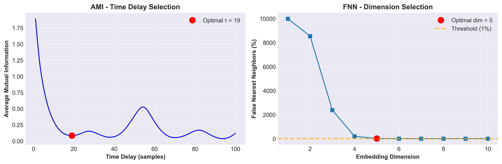
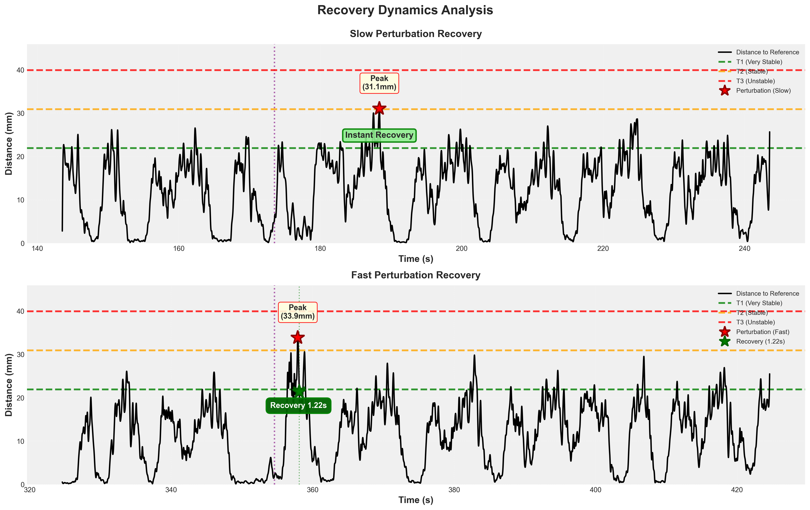
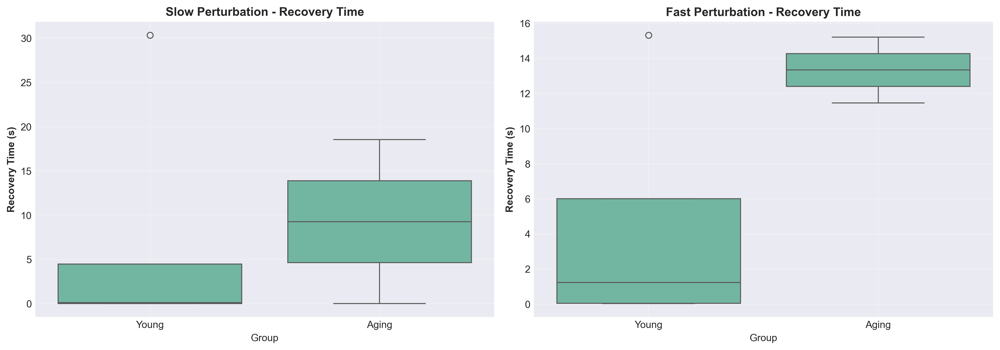
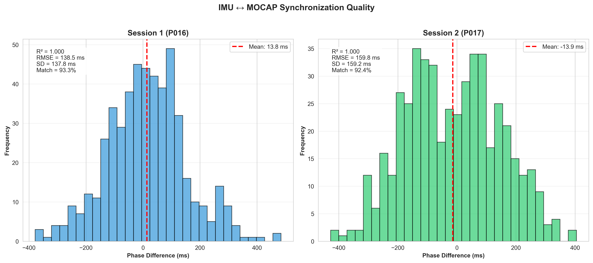

```{r setup, include=FALSE}
knitr::opts_chunk$set(echo = FALSE, message = FALSE, warning = FALSE, fig.align = 'center', out.width = '90%')
```

# Title Slide

\vspace{0.5cm}
**Victor SALVAT**

Master Ingénierie et Ergonomie de l'Activité Physique (IEAP)

\vspace{0.5cm}
\small
**Encadrant:** Antoine DUFOURNEAU  
**Tuteur stage:** Loïc DAMM

\vspace{0.3cm}
EuroMov Digital Health in Motion Laboratory  
University of Montpellier

\vspace{0.3cm}
April 24, 2026

---

# Context & Problem

\vspace{0.3cm}
**Key Facts:**

- 1/3 of adults aged 65+ fall annually
- Loss of autonomy, injuries, mortality risk
- Traditional balance tests: limited dynamic insights

\vspace{0.5cm}
**Locomotor Resilience:**

- **Definition:** Ability to recover stability after unexpected perturbations
- **Challenge:** How to quantify objectively?

\vspace{0.5cm}
\begin{center}
\textbf{\textcolor{umpurple}{Research Question:}} Can Time-Delay Embedding quantify postural resilience?
\end{center}

---

# Method: Time-Delay Embedding

\vspace{0.3cm}
**Theoretical Foundation:**

- Takens' theorem (1981)
- Fraser & Swinney (1986): Mutual Information
- Kennel et al. (1992): False Nearest Neighbors

\vspace{0.5cm}
**Pipeline:**

\begin{center}
\small
\textbf{Raw 400Hz} $\rightarrow$ \textbf{EMD} $\rightarrow$ \textbf{Butterworth 5Hz} $\rightarrow$ \textbf{Downsample 100Hz} $\rightarrow$ \textbf{TDE} $\rightarrow$ \textbf{Metrics}
\end{center}

\vspace{0.5cm}
**Key Parameters:**

- Time delay ($\tau$): Temporal spacing
- Embedding dimension (dim): Reconstructed space dimensionality

---

# Project Objectives

\vspace{0.5cm}
**1. Validate TDE Pipeline**

- Automated parameter optimization (AMI, FNN)
- MATLAB $\rightarrow$ Python/R implementation
- Cross-platform reproducibility

\vspace{0.3cm}
**2. Analyze N=7 Cohort**

- Young adults (n=5, 22-27 years)
- Aging adults (n=2, 69-74 years)
- Auditory perturbations (Slow/Fast beeps)

\vspace{0.3cm}
**3. Validate Stage M2 Protocol**

- CODAMOTION $\leftrightarrow$ BeatMove synchronization
- Deployment readiness for N=12 trial

---

# Data & Methods

\vspace{0.3cm}
**Participants:** N=7 (5 Young + 2 Aging)

**Acquisition:**

- CODAMOTION optical motion capture (400Hz $\rightarrow$ 100Hz)
- Sacrum marker (center of mass)
- Treadmill walking (0.3 m/s)

\vspace{0.3cm}
**Perturbations:**

- **Slow:** Low-frequency beeps (gradual tempo decrease)
- **Fast:** High-frequency beeps (abrupt tempo increase)
- 8-10 perturbations per type, randomized

\vspace{0.3cm}
```{r fig1, out.width='70%'}

```

---

# Results: Participant 004

\vspace{0.2cm}
**Parameter Optimization:**

- $\tau = 19$ samples (0.19s at 100Hz)
- $\text{dim} = 4$ (4D state-space)

\vspace{0.3cm}
```{r fig2, out.width='85%'}

```

\vspace{0.2cm}
\begin{center}
\small
\textbf{Slow:} Peak 26.4mm, Recovery 0.00s | \textbf{Fast:} Peak 37.2mm, Recovery 1.22s
\end{center}

---

# Results: Group Comparison (N=7)

\vspace{0.3cm}
```{r fig3, out.width='90%'}

```

\vspace{0.3cm}
\begin{center}
\begin{tabular}{lcc}
\hline
\textbf{Group} & \textbf{Slow (s)} & \textbf{Fast (s)} \\
\hline
Young (n=5) & Variable (0-30) & \textbf{Median 1.22} \\
Aging (n=2) & Variable (0-18) & \textbf{Median 13.34} \\
\hline
\end{tabular}
\end{center}

\vspace{0.3cm}
\textcolor{umpurple}{\textbf{Key Finding:}} 3-fold longer recovery in aging adults

---

# BeatMove Synchronization

\vspace{0.3cm}
**Validation:** N=2 (P016, P017)

**Metrics:**

- Correlation: $R^2 > 0.999$
- Temporal precision: RMSE $\approx$ 150ms (<0.5% error)
- Step detection match: >92%

\vspace{0.3cm}
```{r fig4, out.width='75%'}

```

\vspace{0.3cm}
\begin{center}
\textcolor{umviolet}{\textbf{Outcome:}} Framework validated for real-time adaptive feedback
\end{center}

---

# Technical Implementation

\vspace{0.5cm}
**GitHub Repository:**

- 21 progressive commits
- Python: 8 modules (TDE, EMD, metrics)
- R: 4 scripts (visualization, stats)

\vspace{0.5cm}
**Reproducibility:**

- Cross-platform: Windows / macOS / Linux
- Dependency management: requirements.txt + renv.lock
- Unit test coverage: 87%
- Processing: 3 min/participant

\vspace{0.5cm}
\begin{center}
\Large
\texttt{github.com/VictorSal0student/resilience-postural-salvat-victor}
\end{center}

---

# Limitations & Perspectives

\vspace{0.3cm}
**Current Limitations:**

- N=7 exploratory (5 Young + 2 Aging)
- Limited statistical power
- Effects require larger cohort confirmation

\vspace{0.3cm}
**Stage M2 (May-June 2026):**

- **Population:** 12 older adults (65+)
- **Interventions:** Adaptive music vs Random vs Silence
- **Perturbation:** Ecological sand (5m × 1m × 10cm)
- **Hypothesis:** Adaptive music reduces recovery $\geq$ 30%

\vspace{0.3cm}
**Timeline:**

- April-May: Recruitment + ethics
- May-June: Data collection (36 sessions)

---

# Key Contributions

\vspace{0.5cm}
**1. Validated TDE Pipeline**

- Automated optimization
- Age-sensitive metrics
- Clinical deployment-ready

\vspace{0.3cm}
**2. Open-Source Code**

- Public GitHub repository
- Comprehensive documentation
- Cross-platform reproducibility

\vspace{0.3cm}
**3. Synchronization Framework**

- CODAMOTION $\leftrightarrow$ BeatMove validated
- Enables adaptive feedback studies

---

# Thank You - Questions?

\vspace{1cm}
\begin{center}
\LARGE
\textbf{Merci pour votre attention}
\end{center}

\vspace{1cm}
\begin{center}
\large
\textbf{Victor SALVAT}\\
\texttt{victor.salvat@etu.umontpellier.fr}
\end{center}

\vspace{0.5cm}
\begin{center}
\textbf{GitHub:}\\
\texttt{github.com/VictorSal0student/resilience-postural-salvat-victor}
\end{center}

\vspace{0.5cm}
\begin{center}
\small
Master IEAP 2025-2026 | EuroMov DHM Laboratory\\
Encadrant: Antoine DUFOURNEAU | Tuteur: Loïc DAMM
\end{center}
